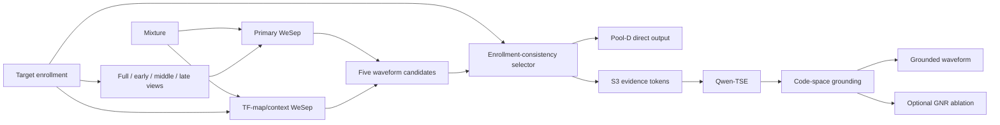

# LLM-TSE Grounding

Research code for **speaker-consistent grounding and confusion repair in
LLM-based target speaker extraction (TSE)**.

An LLM speech generator can produce natural-sounding output while drifting in
speaker identity or lexical content. This project addresses the problem in two
steps:

1. **Repair before grounding.** Generate complementary frozen TSE candidates
   and select the waveform most consistent with the target enrollment.
2. **Grounded generation.** Constrain autoregressive S3-token generation to
   remain close to the selected evidence in the native FSQ code space.

This private repository now contains both the small NumPy reference operators
and the curated end-to-end research pipeline used for the ICASSP 2027 study.
Data, model weights, generated audio, caches, machine orchestration, and private
server paths are deliberately excluded.

## Method overview



### Pool-D confusion repair

Pool-D contains five frozen candidates:

- `full`, `first`, `middle`, and `final` from one speaker-embedding TSE model
  with deterministic enrollment views;
- `tfmap_context_full` from the complementary TF-map/context checkpoint.

The deployable selector uses only target-enrollment speaker similarity. It
never uses the clean target, interferer reference, transcript, WER, SI-SDR, or
an oracle label.

### Code-space grounding (CSG)

CosyVoice3 S3 tokens use an eight-coordinate ternary FSQ vocabulary:

```text
vocabulary size = 3^8 = 6561
token id = sum(digit[d] * 3^d), d = 0..7
```

At generation step `t`, fixed CSG applies

```text
grounded_logit(v) = llm_logit(v)
                    - lambda * min_delta Hamming(v, evidence[t + delta])
```

The frozen reliability operating point uses `lambda=1` and temporal tolerance
`w=0`.

### Grounded-neighborhood refinement (GNR)

GNR is a conservative ablation around a complete CSG anchor:

```text
candidate set = TopK(Q-Full logits) ∩ HammingBall_R(anchor) ∪ {anchor}
```

Teacher-forced logits are computed against the immutable original anchor;
refined tokens are never fed into later histories. DEV selected `K=20, R=2`
within the GNR family, but GNR did not outperform fixed CSG overall.

## What is included

| Path | Purpose |
|---|---|
| `src/llm_tse_grounding/` | Lightweight NumPy implementations of Pool-D selection, FSQ geometry, CSG, GNR, and paired statistics |
| `se_align/tse/` | Qwen/WavLM target-speaker token model |
| `se_align/train/` | Token vocabulary, projectors, datasets, and training utilities |
| `se_align/codec/` | CosyVoice3 S3 tokenizer and waveform synthesis adapter |
| `se_align/data/` | Manifest, waveform, token, and TSE dataset contracts |
| `se_align/eval/` | ASR-consistency, speaker, intrusive, and perceptual metric implementations |
| `scripts/tse/` | Manifest preparation, feature extraction, training, decoding, and baseline evaluation |
| `scripts/tse_candidate_gate/` | Frozen WeSep candidate generation, embedding extraction, scoring, selection, and validation |
| `scripts/tse_selected_evidence/` | Clean selected-evidence tokenization, generation, evaluation, and paper-table compilation |
| `scripts/tse_noisy_wham/` | WHAM! preparation, noisy candidate analysis, CSG/GNR decoding, frozen protocol checks, evaluation, and paired statistics |
| `configs/tse_*.yaml` | Portable examples of the experiment configuration |
| `tests/` | Lightweight operator tests and TSE data/model contract tests |
| `paper/` | ICASSP manuscript source and rendered draft |
| `demo/` | Standalone project/demo page |

The detailed stage-by-stage entry points are documented in
[`docs/PIPELINE.md`](docs/PIPELINE.md). The relationship between the compact
operators and full research scripts is documented in
[`docs/CODE_MAP.md`](docs/CODE_MAP.md); the lab5090 synchronization audit is in
[`docs/SYNC_PROVENANCE.md`](docs/SYNC_PROVENANCE.md).

## Installation

### Lightweight operator package

```bash
git clone https://github.com/Hanyu-Meng/LLM-TSE-Grounding.git
cd LLM-TSE-Grounding
python -m venv .venv
source .venv/bin/activate
python -m pip install -e .
```

This installs the auditable NumPy reference implementation and CLI.

### Full research pipeline

The full pipeline depends on PyTorch, Transformers, audio/metric packages, and
external frozen components:

```bash
python -m pip install -r requirements-pipeline.txt
```

For the exact CosyVoice3 environment, install its dependencies first and then
install the additional metric packages without forcing incompatible Torch or
ONNX Runtime versions. See [`configs/README.md`](configs/README.md) before
running an experiment.

Required external assets are expected under ignored directories such as:

```text
external/CosyVoice/
external/wesep-real-tse/
external/LibriMix/
external/LibriSpeech/
external/wham_noise/
pretrained/Qwen2.5-0.5B-Instruct/
pretrained/wavlm-base-plus/
pretrained/Fun-CosyVoice3-0.5B/
pretrained/wesep/
```

No third-party model, corpus, or checkpoint is redistributed here.

## Quick validation

Run the CPU-only reference checks:

```bash
python -m unittest discover -s tests -p 'test_core.py' -v
python examples/minimal_demo.py
llm-tse-grounding --help
```

With the full pipeline dependencies installed, run the TSE contract test:

```bash
python -m pytest tests/test_tse.py -q
```

Compile every synced Python source without importing model dependencies:

```bash
python -m compileall -q src se_align scripts tests
```

## Reproducibility boundary

- Model and policy choices are made on DEV only.
- Clean TEST and Natural Noisy TEST are frozen confirmation sets.
- Noisy TEST was executed once: `execution_count=1`,
  `post_test_tuning=false`.
- Natural-noise and controlled-SNR results are reported separately.
- Uncapped utterance-mean WER is not replaced by capped WER.
- Speaker/content switch rates, trial counts, and paired uncertainty are
  reported together.
- The post-TEST DEV router and multi-lambda/token-level method-development
  experiments are not included in this repository snapshot.

Read [`docs/REPRODUCIBILITY.md`](docs/REPRODUCIBILITY.md) before adapting the
pipeline or interpreting the result tables.

## Paper and demo

- [`paper/`](paper/) contains the ICASSP manuscript source and latest bundled
  draft available in this repository snapshot.
- [`demo/`](demo/) contains a standalone local project page.
- The public listening page is maintained separately at
  [hanyu-meng.github.io/LLM-TSE-Grounding-Demo](https://hanyu-meng.github.io/LLM-TSE-Grounding-Demo/).

Run the bundled demo locally:

```bash
python -m http.server 8000 --directory demo
```

Then open `http://127.0.0.1:8000/`.

## External projects

The pipeline builds on:

- [WeSep](https://github.com/wenet-e2e/wesep) for target speaker extraction;
- [CosyVoice](https://github.com/FunAudioLLM/CosyVoice) for S3 tokenization and
  waveform synthesis;
- [Qwen2.5](https://huggingface.co/Qwen/Qwen2.5-0.5B-Instruct) as the language
  model backbone;
- [WavLM](https://huggingface.co/microsoft/wavlm-base-plus) for mixture
  features;
- [LibriMix](https://github.com/JorisCos/LibriMix), LibriSpeech, and WHAM! for
  clean and noisy TSE evaluation.

Each dependency and corpus remains subject to its own license and terms.
