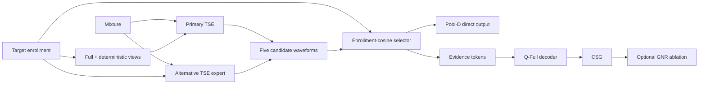
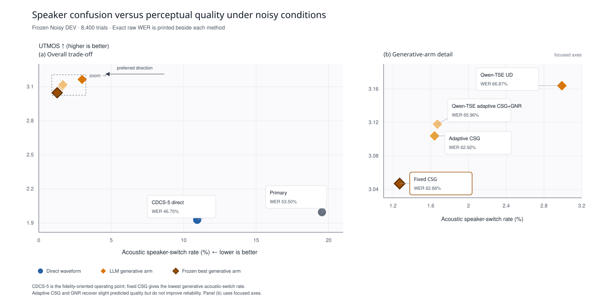

# LLM-TSE Grounding

Compact research code for **Repair Before Grounding** in LLM-based target
speaker extraction (TSE).

The central failure mode is not always noisy or silent output: a TSE system can
produce fluent speech from the *wrong speaker*. Passing that waveform directly
to a generative speech model gives the model unreliable evidence. This project
therefore separates the problem into two stages:

1. **Confusion repair:** generate complementary frozen TSE candidates and use
   target-enrollment speaker consistency to select the most reliable evidence.
2. **Grounded generation:** constrain LLM audio-token decoding to remain close
   to the repaired evidence in the native FSQ code space.
3. **Content-preserving fallback (experimental):** use grounded output only
   for low-confidence evidence and fall back to the repaired direct waveform
   when token drift or an enabled output-only guard is unsafe.

This repository is the cleaned, portable core of the larger experimental
pipeline used for an ICASSP 2027 study. It intentionally contains method code,
small tests, frozen configuration metadata, compact result summaries, the
paper source, and a curated listening demo. It does not contain server
orchestration, checkpoints, manifests, private paths, or bulk generated
outputs.

## Paper and interactive demo

- [`paper/`](paper/) contains the compact ICASSP manuscript source and the
  latest rendered draft. Table 1 is reserved for frozen TEST results; Table 2
  permanently preserves the full Noisy DEV selection and ablation evidence.
- [`demo/`](demo/) contains a standalone research-story page with three
  independent result views: Clean TEST, Noisy DEV, and Noisy TEST. Importing a
  completed Noisy TEST payload updates only the Noisy TEST view and never
  overwrites DEV.

Run the demo locally:

```bash
python -m http.server 8000 --directory demo
```

Then open `http://127.0.0.1:8000/`. The demo links back to this repository so
the narrative, frozen configuration, method implementation, and paper source
remain traceable from one place.

## Method at a glance



### 1. Pool-D confusion repair

Pool-D contains five frozen candidates:

- `full`, `first`, `middle`, `final`: one speaker-embedding TSE checkpoint with
  deterministic enrollment views;
- `tfmap_context_full`: an alternative checkpoint using TF-map/context
  conditioning.

The deployable selector chooses the maximum cosine similarity between each
candidate output and the target enrollment. It does **not** use clean target
audio, interferer references, transcripts, WER, or SI-SDR.

### 2. Code-space grounding (CSG)

CosyVoice3 S3 tokens use an eight-coordinate ternary FSQ vocabulary:

```text
vocabulary size = 3^8 = 6561
token id = sum(digit[d] * 3^d), d = 0..7
```

At generation step `t`, CSG applies

```text
grounded_logit(v) = llm_logit(v) - lambda * min_delta Hamming(v, evidence[t + delta])
```

where `delta` is controlled by the temporal tolerance. The frozen fixed system
uses `lambda=1, w=0`.

### 3. Grounded neighborhood refinement (GNR)

GNR is a conservative ablation around a complete CSG anchor. At each position,
the candidate set is

```text
TopK(Q-Full logits) ∩ HammingBall_R(anchor) ∪ {anchor}
```

The logits are computed once with teacher forcing over the **immutable original
anchor**. Refined tokens never feed later histories. DEV selected `K=20, R=2`
within the GNR family, but GNR did not outperform fixed CSG overall.

### 4. Content-preserving grounding gate (DEV-only)

`content_gate.py` implements a fail-closed gate between Pool-D direct and CSG.
The token-only operating point uses only target-enrollment cosine and the CSG
token-flip rate. An optional stronger guard can also reject implausible word
rate, repeated ASR bigrams, or low output-only DNSMOS. None of these inputs
uses clean target audio, the paired interferer, a reference transcript, WER,
or SI-SDR.

On the frozen 8,400-trial Noisy DEV outputs, the token-only gate reduces raw
WER from 62.66% for always-on fixed CSG to 54.03%, with acoustic switching at
1.86%. The exploratory stronger guard reaches 48.99% WER and 2.12% acoustic
switching. These are retrospective DEV analyses, not frozen Noisy TEST claims;
the stronger guard also needs independent-ASR or listening validation before
paper use.

`scripts/evaluate_content_gate.py` reproduces this comparison from cached
per-trial direct/CSG metrics, CSG token diagnostics, candidate similarities,
and manifest metadata. It writes every arm choice, aggregate and per-condition
CSVs, and mixture-cluster bootstrap confidence intervals without decoding new
audio or reading TEST outcomes.

## Frozen Noisy DEV snapshot

All rows contain the same 8,400 DEV trials. These are DEV results, not final
Noisy TEST claims.

| System | Raw WER ↓ | Content switch ↓ | Acoustic switch ↓ | Speaker margin ↑ | DNSMOS-OVRL ↑ | UTMOS ↑ |
|---|---:|---:|---:|---:|---:|---:|
| Primary WeSep | 53.50 | 20.11% | 19.54% | 0.269 | 2.243 | 1.997 |
| **Pool-D direct** | **46.75** | **11.86%** | 10.93% | 0.332 | 2.132 | 1.930 |
| Q-Full UD | 66.87 | 13.68% | 2.99% | 0.362 | 3.063 | **3.164** |
| **Fixed CSG** | **62.66** | 13.44% | **1.27%** | **0.370** | 3.066 | 3.047 |
| Adaptive CSG | 62.92 | **13.42%** | 1.64% | 0.369 | 3.079 | 3.104 |
| Selected GNR (`K20/R2`) | 65.96 | 13.44% | 1.67% | 0.369 | **3.081** | 3.118 |

The intended interpretation is deliberately two-operating-point:

- **Pool-D direct** is the fidelity-oriented result and gives the best WER.
- **Fixed CSG** is the strongest generative reliability arm: relative to
  ungrounded Q-Full it reduces WER and acoustic speaker switches while
  preserving predicted perceptual quality.
- Adaptive CSG and GNR are useful negative ablations. They slightly increase
  predicted quality but do not improve reliability over fixed CSG.

Raw WER is high because the aggregate includes controlled -5/0/5/10/15 dB
conditions and ASR insertions; a single utterance can have raw WER above 100%.



## Repository layout

```text
src/llm_tse_grounding/
  candidate_selection.py  # deterministic Pool-D selector
  fsq.py                   # 3^8 FSQ conversion and Hamming geometry
  csg.py                   # CSG logit penalty
  content_gate.py          # inference-only direct/grounded safety gate
  gnr.py                   # immutable-anchor neighborhood refinement
  difficulty.py            # deployable residual-ratio ablation
  statistics.py            # Wilson CI and paired bootstrap
  cli.py                    # small file-based command line interface
configs/
  frozen_noisy_dev.yaml    # path-free frozen choices
examples/
  minimal_demo.py          # CPU-only operator demo
tests/
  test_core.py             # invariant and regression tests
results/
  noisy_dev_summary.csv    # compact source data for the table above
paper/
  main.tex                 # ICASSP manuscript
  results_macros.tex       # centralized frozen result values
  tables/                  # TEST, DEV-ablation, mechanism, and cost tables
demo/
  index.html               # standalone paper/demo page
  app.js                   # split-safe result rendering
docs/
  CODE_MAP.md              # mapping from internal campaign code
  REPRODUCIBILITY.md       # leakage and evaluation boundaries
```

## Installation

```bash
git clone https://github.com/Hanyu-Meng/LLM-TSE-Grounding.git
cd LLM-TSE-Grounding
python -m venv .venv
source .venv/bin/activate
python -m pip install -e .
```

The portable core requires only NumPy. Full waveform/token generation still
requires your own integrations for the frozen TSE models, Qwen, WavLM, and
CosyVoice3.

## Quick checks

```bash
python -m unittest discover -s tests -v
python examples/minimal_demo.py
llm-tse-grounding --help
```

File-based operator examples:

```bash
# Apply a CSG penalty to T x 6561 logits.
llm-tse-grounding csg \
  --logits llm_logits.npy \
  --evidence evidence_tokens.npy \
  --lambda 1.0 \
  --temporal-tolerance 0 \
  --output grounded_tokens.npy

# Refine an immutable anchor using teacher-forced Q-Full logits.
llm-tse-grounding gnr \
  --logits teacher_forced_logits.npy \
  --anchor anchor_tokens.npy \
  --top-k 20 \
  --radius 2 \
  --output refined_tokens.npy \
  --stats gnr_stats.json
```

See [`docs/REPRODUCIBILITY.md`](docs/REPRODUCIBILITY.md) before integrating the
operators into an evaluation pipeline.

## External components

This repository does not vendor third-party code or weights. The full research
system builds on:

- [WeSep](https://github.com/wenet-e2e/wesep) for target speaker extraction;
- [CosyVoice](https://github.com/QwenAudio/CosyVoice) for S3 tokenization and
  waveform synthesis;
- [Qwen2.5](https://huggingface.co/Qwen/Qwen2.5-0.5B-Instruct) as the token
  language-model backbone;
- [LibriMix](https://github.com/JorisCos/LibriMix) and WHAM! noise for the noisy
  evaluation setting.

Data, checkpoints, bulk generated audio, transcripts, embeddings, and
server-specific paths are intentionally excluded. A small set of curated clean
listening examples is included under `demo/public/assets/audio/` solely to make
the paper's failure-and-repair cases inspectable. Each external component and
source corpus remains subject to its own license and usage terms.

## Status

The compact method core, manuscript, demo, frozen Clean TEST evidence, and full
Noisy DEV snapshot are available here. The one-run frozen Noisy TEST evaluation
is not inserted until its full pipeline and artifact checks are complete. No
post-TEST tuning is permitted.
